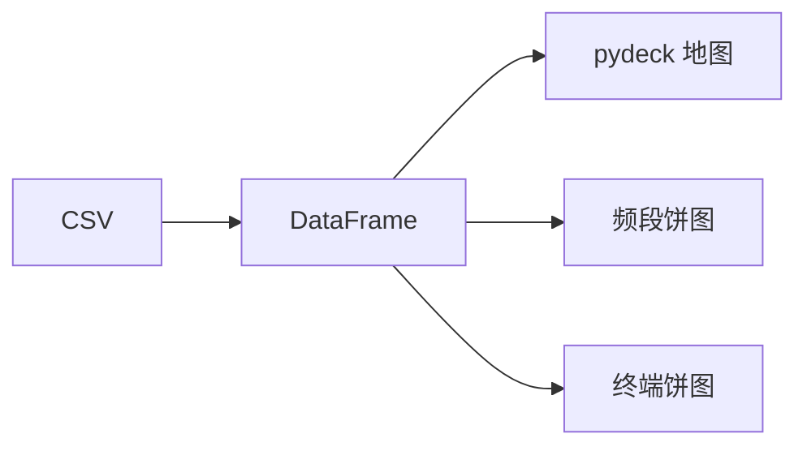

# 5G 信号可视化看板 — 设计文档

## 概述

基于 Streamlit + pandas 构建的交互式 Web 数据可视化看板，读取 5G 路测 CSV 数据，在地图上展示信号覆盖情况，并统计频段和终端分布。

## 技术栈

- **框架**: Streamlit
- **数据处理**: pandas
- **地图**: st.pydeck_chart（Deck.GL，支持自定义点颜色）
  - 注: `st.map` 不支持点颜色映射，故使用 pydeck
- **图表**: plotly（饼图）

## 功能规格

### 1. 数据加载
- 使用 `pandas.read_csv()` 读取 `data/signal_samples.csv`
- 数据包含: Latitude, Longitude, CellID, Band, RSRP_dBm, SINR_dB, TerminalType, Download_Mbps

### 2. 交互地图
- 使用 `st.pydeck_chart`（Deck.GL ScatterplotLayer）渲染交互地图
- 每个数据点根据 RSRP_dBm 着色（颜色映射在数据预处理阶段计算）:
  - > -90 dBm → 绿色（信号强）
  - < -110 dBm → 红色（信号弱）
  - -90 ~ -110 dBm → 黄色渐变过渡

### 3. 饼图统计
- 地图下方并排显示两张饼图:
  - 各频段基站数量统计（n28, n41, n78）
  - 不同类型终端占比（Smartphone, CPE, IoT）
- 使用 plotly 绘制，悬停显示数值

## 布局结构

```
标题区: 🚀 5G 信号可视化看板
地图区: pydeck 散点地图，点颜色 = RSRP 渐变
图表区: 2 列并排 — [频段饼图] [终端饼图]
```

## 数据流



## 实现约束

- 纯 Python，无需额外前端代码
- 所有依赖在 requirements.txt 中已包含（streamlit, pandas, pydeck, numpy）
- 启动方式: `streamlit run app.py`
