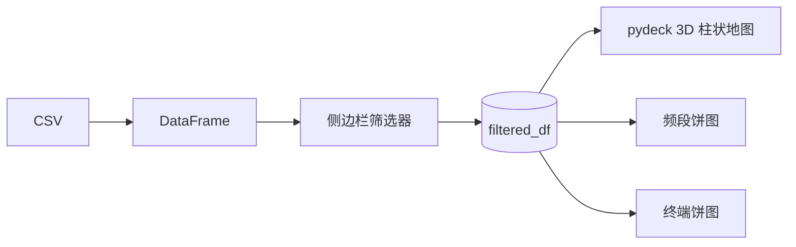

# 5G 信号可视化看板增强 — 设计文档

## 概述

在现有 5G 信号看板基础上增加三项功能：3D 柱状地图、侧边栏筛选器、实时联动更新。

## 技术栈

- **框架**: Streamlit（不变）
- **地图**: pydeck `ColumnLayer`（替换 `ScatterplotLayer`）
- **图表**: plotly 饼图（不变）

## 功能规格

### 1. 3D 柱状图

- 将 `ScatterplotLayer` 替换为 `pydeck.ColumnLayer`
- 每根柱子对应一个信号采样点
- **柱子高度** = 归一化的 `Download_Mbps`（Min-Max 归一化映射到 200–1500 米）
- **柱子颜色** = 基于 `RSRP_dBm` 的现有颜色映射（绿→黄→红），沿用 `rsrp_to_color()` 函数
- ColumnLayer 参数：
  - `get_elevation`: `"height"`（归一化后的列）
  - `elevation_scale`: 1
  - `get_position`: `["Longitude", "Latitude"]`
  - `get_fill_color`: `"color"`
  - `radius`: 50（柱子粗细）

### 2. 侧边栏筛选器

左侧 `st.sidebar` 放置两个控件：

- **频段下拉菜单** (`st.sidebar.selectbox`)
  - 选项：`["全部", "n28", "n41", "n78"]`
  - 从数据中动态读取唯一值
  - 默认值：`"全部"`

- **RSRP 范围滑动条** (`st.sidebar.slider`)
  - 最小值：`df["RSRP_dBm"].min()`
  - 最大值：`df["RSRP_dBm"].max()`
  - 默认值：全范围
  - 步长：1 dBm

### 3. 实时更新（联动）

- 基于侧边栏的值对 DataFrame 进行筛选生成 `filtered_df`
- 所有图表（地图、频段饼图、终端类型饼图）都使用 `filtered_df` 而非原始 `df`
- Streamlit 天然支持：任意 widget 变化触发脚本重执行，三个图表同步更新

### 4. 两张饼图

- 保留现有两张饼图（频段分布、终端类型分布）
- 数据源从 `df` 改为 `filtered_df`，自动反映当前筛选结果

## 布局结构

```
标题区: 🚀 5G 信号可视化看板
侧边栏:
  ├── 频段: [下拉菜单]
  └── RSRP: [滑动条 ─────]
地图区: pydeck ColumnLayer 3D 柱状地图
图表区: 2 列并排 — [频段饼图] [终端饼图]
```

## 数据流



## 实现约束

- 纯 Python，单文件 `app.py`
- 无需额外依赖（ColumnLayer 是 pydeck 内置图层）
- 启动方式不变: `streamlit run app.py`
